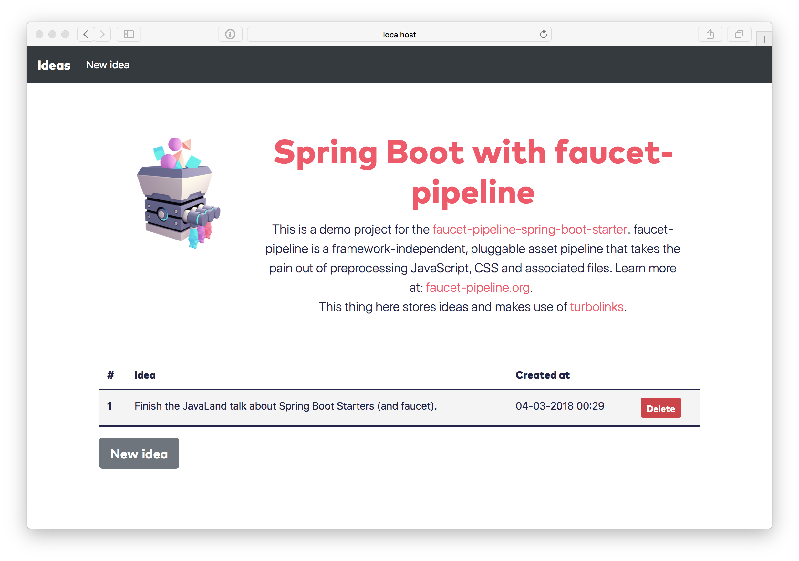

:faucet-starter-version-sb2: 1.3.0
:faucet-starter-version-sb3: 2.0.0

== faucet-pipeline-spring-boot-starter

image:https://img.shields.io/github/license/faucet-pipeline/faucet-pipeline-spring-boot-starter[GitHub]
image:https://img.shields.io/github/actions/workflow/status/faucet-pipeline/faucet-pipeline-spring-boot-starter/build.yml?branch=master[GitHub Workflow Status (with branch)]
https://maven-badges.herokuapp.com/maven-central/org.faucet-pipeline/faucet-pipeline-spring-boot-starter[image:https://maven-badges.herokuapp.com/maven-central/org.faucet-pipeline/faucet-pipeline-spring-boot-starter/badge.svg[Maven
Central]]

A Spring Boot starter and auto-configuration for the
http://www.faucet-pipeline.org[faucet-pipeline]:

____
tl;dr: faucet-pipeline is a framework-independent, pluggable asset
pipeline that takes the pain out of preprocessing JavaScript, CSS and
associated files (e.g. images or fonts). It simplifies the process of
converting modern JavaScript (ES6) to support older browsers (ES5), or
Sass to CSS - eliminating typical low-level configuration nightmares.
____

The faucet-pipeline bundles your application files, fingerprints them
and creates a manifest for them. It also can be used to watch the
configured files and rerun the process during development.

== Introduction

This starter is needed when you want to use faucet with your
https://projects.spring.io/spring-boot/[Spring Boot] project. The
following issues have to be tackled:

* The resource processed through the pipeline ("assets") should not be
part of the regular Java / Groovy / Kotlin sources and other resources
of the project. As such, the assets would be copied by the build system
(either Maven or Gradle) itself. You have to provide a place for the
assets, this is not something the starter can do for you.
* The processed assets need to be in the class path of the Spring
Application. This is also a build step, that the starter cannot do for
you.

What the starter does however are the following tasks:

* It checks whether a faucet-manifests exists (defaults to
`classpath:/manifest.json`) and if so, loads it
* It checks whether the application is either a servlet or reactive web
application. If not, the starter does nothing.
* For a web application it registers a `ResourceResolver` that is able
to retrieve internal urls that might are the output of finger printing
and map them to external urls.

This works for servlet and reactive Spring applications.

== tl;dr

[source,console]
git clone git@github.com:faucet-pipeline/faucet-pipeline-spring-boot-starter.git
cd faucet-pipeline-spring-boot-starter
./mvnw clean install
cd demo-webmvc
FAUCETPIPELINE_CACHEMANIFEST=false ./mvnw spring-boot:run

Goto http://localhost:8080[localhost:8080].

== Usage and configuration

=== Runtime

Just include the starter in your pom.xml:

==== For Spring Boot 2.x.x

[source,xml, subs="attributes,specialchars"]
<dependency>
    <groupId>org.faucet-pipeline</groupId>
    <artifactId>faucet-pipeline-spring-boot-starter</artifactId>
    <version>{faucet-starter-version-sb2}</version>
</dependency>

or in your build.gradle:

[source,groovy,subs="attributes"]
implementation 'org.faucet-pipeline:faucet-pipeline-spring-boot-starter:{faucet-starter-version-sb2}'

==== For Spring Boot 3.0.x

[source,xml, subs="attributes,specialchars"]
<dependency>
    <groupId>org.faucet-pipeline</groupId>
    <artifactId>faucet-pipeline-spring-boot-starter</artifactId>
    <version>{faucet-starter-version-sb3}</version>
</dependency>

or in your build.gradle:

[source,groovy,subs="attributes"]
implementation 'org.faucet-pipeline:faucet-pipeline-spring-boot-starter:{faucet-starter-version-sb3}'

The starter can only work if Springs
https://docs.spring.io/spring-framework/docs/current/reference/html/web.html#mvc-config-static-resources[resource
chain] is active. The starter won’t activate this for you, so please
configure

....
spring.web.resources.chain.enabled=true
....

The resource resolver will be mapped to `/**`, so basically that’s it.

== Compile time

Make sure that your assets end up into `/classes` (maven) or
`/resources/main` (gradle). This project contains two demos,
`demo-webmvc` and `demo-webflux`. The following approach is from
`demo-webmvc`.

== Configure your faucet-pipeline

Follow the instructions from the website:

[source,console]
npm init # gets you a fresh package.json
npm install --save\ # Installs the pipeline for you
      faucet-pipeline-js\
      faucet-pipeline-sass\
      faucet-pipeline-static

In your `package.json` add the following scripts:

[source,json]
"scripts": {
    "compile": "faucet --fingerprint --compact",
    "watch": "faucet --no-fingerprint --watch"
}
....

The `compact`-switch is optional.

Create a `faucet.config.js` next to `package.json`. Here’s the one from
`demo-webmvc``

[source,js]
....
let targetBaseDir = "./target/classes/static"
const path = require('path');

module.exports = {
    js: [{
        source: "./src/main/assets/javascripts/application.js",
        target: targetBaseDir + "/javascripts/application.js"
    }],
    sass: [{
        source: "./src/main/assets/stylesheets/application.scss",
        target: targetBaseDir + "/stylesheets/application.css"
    }],
    static: [{
        source: "./src/main/assets/images",
        target: targetBaseDir + "/images"
    }],
    manifest: {
        target: "./target/classes/manifest.json",
        key: 'short',
        webRoot: targetBaseDir
    }
};
....

You’ll notice that it puts the all processed assets into
`./target/classes/static`. That is where Spring Boot looks for static
files by default. Pushing it directly into the classes folder allows
dynamic reloading later on. An alternative would be going through
`generated-resources`.

As the above configuration writes the assets into subdirectories, you
have to configure your Spring application to include those path
patterns:

....
faucet-pipeline.path-patterns = /javascripts/**, /stylesheets/**, /images/**
....

== Add `frontend-maven-plugin` (maven)

https://github.com/eirslett/frontend-maven-plugin[frontend-maven-plugin]
is ``Maven-node-grunt-gulp-npm-node-plugin to end all
maven-node-grunt-gulp-npm-plugins.'':

With the `package.json` and faucet-configuration in place, add the
following configuration:

[source,xml]
<plugin>
    <groupId>com.github.eirslett</groupId>
    <artifactId>frontend-maven-plugin</artifactId>
    <version>1.6</version>
    <executions>
        <execution>
            <id>install-node-and-npm</id>
            <goals>
                <goal>install-node-and-npm</goal>
            </goals>
            <phase>generate-resources</phase>
            <configuration>
                <nodeVersion>v9.5.0</nodeVersion>
            </configuration>
        </execution>
        <execution>
            <id>install-node-dependencies</id>
            <goals>
                <goal>npm</goal>
            </goals>
        </execution>
        <execution>
            <id>run-faucet-pipeline</id>
            <goals>
                <goal>npm</goal>
            </goals>
            <configuration>
                <arguments>run compile --fingerprint</arguments>
            </configuration>
        </execution>
    </executions>
</plugin>

This downloads Node and NPM and installs all dependencies via
`package.json` and executes the pipeline during build. Assuming that
your Spring Boot application has the Spring Boot Maven plugin configured
like so

[source,xml]
<plugin>
    <groupId>org.springframework.boot</groupId>
    <artifactId>spring-boot-maven-plugin</artifactId>
</plugin>

you can run the application with `mvn spring-boot:run`. When you use a
supported template language like Thymeleaf and the URL-helper they
offer, links to assets will contain the finger printed resources
automatically. Those links

[source,html]
<link th:href="@{/stylesheets/application.css}" rel="stylesheet" data-turbolinks-track="reload">

Will be turned into

[source,html]
<link href="/stylesheets/stylesheets/application-70d5f3dc18d122548efadcedfc0874f0.css" rel="stylesheet" data-turbolinks-track="reload">

== With gradle:

Add

[source,groovy]
buildscript {
    repositories {
        maven {
            url "https://plugins.gradle.org/m2/"
        }
    }
    dependencies {
        classpath "com.moowork.gradle:gradle-node-plugin:1.2.0"
    }
}

// ...plugins
[source,groovy]
apply plugin: "com.moowork.node"

to your build.gradle to being able to execute npm/yarn. +
Then add a frontend build task and let the `bootRun` task depend on it:

[source,groovy]
....
task buildFrontend(type: YarnTask) {
    args = ['run', 'compile']
}

bootRun.dependsOn buildFrontend
....

Now you can run `gradle bootRun` to run your application.

== Automatic restart, manifest caching

Use `spring-boot-devtools` to automatically reload the application when
things change:

[source,xml]
<dependency>
    <groupId>org.springframework.boot</groupId>
    <artifactId>spring-boot-devtools</artifactId>
</dependency>

The manifest is cached by default but that can be turned off via
`faucet-pipeline.cache-manifest = false`. One easy way to do this
without hardcoding it into a properties file is as an environment
variable:

Run the demo in one window like so:

[source,console]
FAUCETPIPELINE_CACHEMANIFEST=false ./mvnw spring-boot:run

And in another terminal

[source,console]
npm run watch

And you’ll see the assets being processed and refreshed in the app.

== About the demo application

Both demos - for WebMVC and Webflux - collect ideas. They use
https://github.com/turbolinks/turbolinks[Turbolinks] for quick
navigation between server side rendered sites. Turbolinks come from
http://rubyonrails.org[Ruby on Rails].

The demo is a Bootstrap-based site branded with the
https://github.com/innoq/innoq-bootstrap-theme[INNOQ-theme] and it looks
like this:

=== Going reactive

The `demo-webflux` Version is a fully reactive, Spring 5 + Kotlin based
application. Please start this one directly as JAR, the Maven Spring
Boot Plugin seems to configure stuff slightly differently.